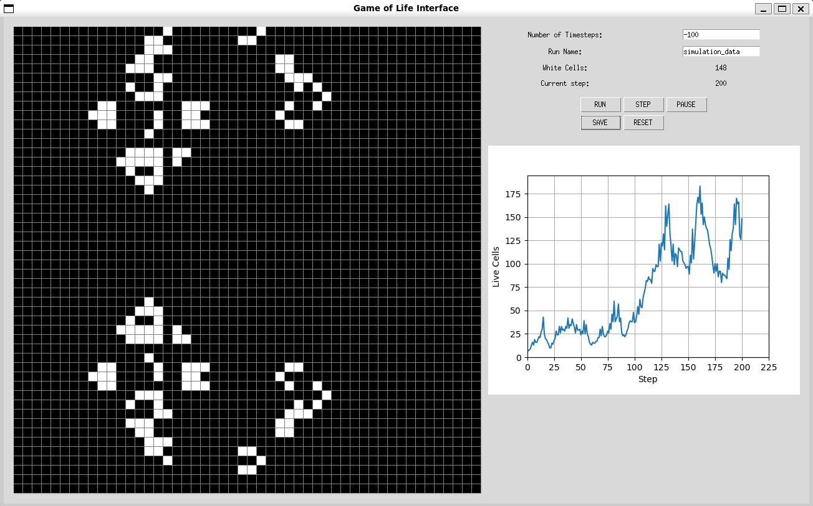
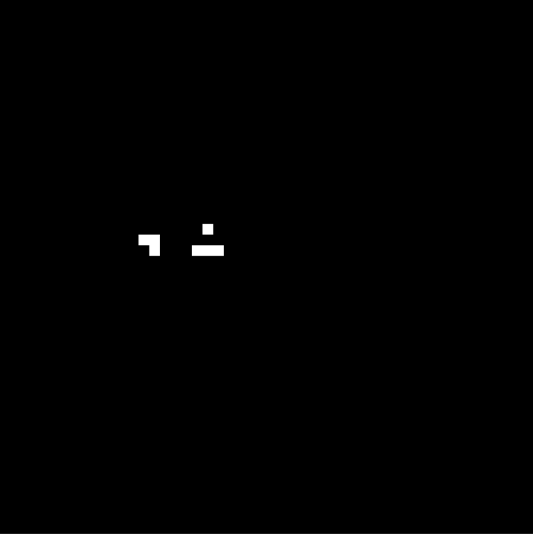
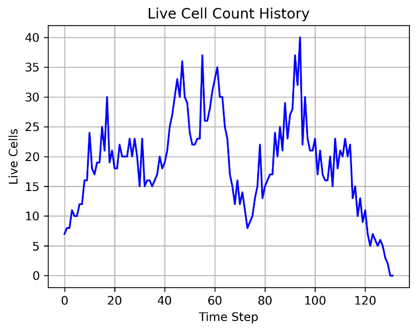

# *Conway's Game of Life* User Interface for Pseudo-Stochastic Process Data Collection
## Overview
This is a Python-based GUI to construct initial states for *Conway's Game of Life* for the purpose of collecting evolution data. The game is played on a 1000 x 1000 square canvas (non-periodic borders), with only the center 50 x 50 squares visible to the user by default. The image below shows what the interface looks like.   



## Motivation

The purpose for designing the interface and collecting the data is to examine the game from a stochastic processes PoV: the game's behavior is entirely deterministic, but if we hide the live cells' spatial information and only look at the ***number of live cells***, many initial configurations lead to graphs that look decidedly stochastic. For instance, the following pattern is called "[Diehard](https://conwaylife.com/ref/lexicon/lex_d.htm#diehard);" all its cells will always die out at time step 130.

   

Here's a plot of the number of live cells for Diehard:   

   

The rules of ***Conway's Game of Life*** ensure that the state of a cell in the current time step depends only on the states of its 8 neighbors in the previous time step. Through this, we can deduce that from the number of live cells at time $t$ is memoryless--it only depends on the number of live cells in the previous step.

## Contents and Usage
To install the required libraries with conda, run the following:   
```(bash)
conda create -n gol -f requirements.txt
conda activate gol
```
The following Python files contain all the code needed to run:
- [playground.py](playground.py): contains the class for the GoL grid/board/whatever-you-want-to-call-it
- [interface.py](interface.py): contains the code that runs the GUI and allows the user to control the game.

### To run the interface:
```(bash)
python interface.py
```
